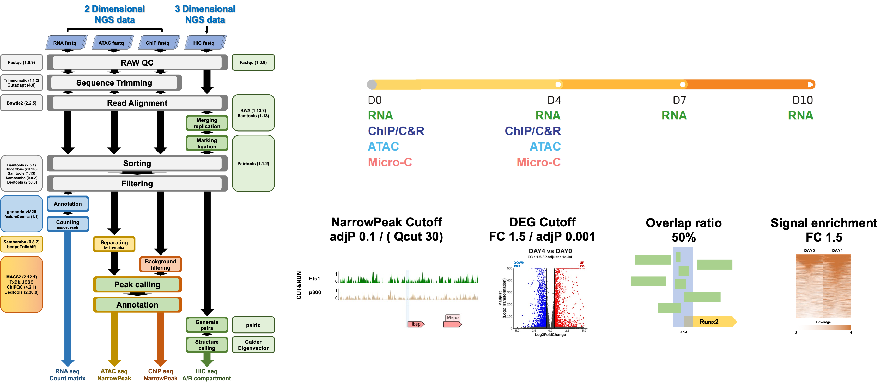

# Ets1 bioinformatics analysis user codes
The paper focuses on how chromatin architecture dynamics during osteoblast differentiation affect osteogenic genes, and on the mechanisms by which chromatin architecture dynamics occur in osteoblasts, and is published in AAAAA.

Osteogenesis is governed by the coordinated interplay between transcriptional networks and epigenetic regulation. Beyond linear gene control, emerging work highlights three-dimensional (3D) chromatin architecture—particularly the segregation into transcriptionally active A and repressive B compartments—as a key regulatory layer that shapes lineage-specific gene expression. Although compartment reorganization accompanies differentiation, the upstream mechanisms that drive this remodeling during osteoblast specification remain insufficiently defined. Lineage commitment proceeds through discrete transition points at which pioneer transcription factors access compact chromatin, displace nucleosomes, and recruit chromatin-modifying enzymes. Studies of Pax7, MyoD, and ETV2 demonstrate that pioneers regulate both chromatin accessibility and 3D genome organization, establishing an epigenetically primed landscape. Epigenetic priming, including H3K27ac pre-marking of enhancers, helps determine responsiveness to osteogenic cues such as BMP2 and Wnt3a, with committed cells (e.g., MC3T3-E1) showing robust induction. We hypothesize that Ets1 acts as a pioneer in early osteoblast differentiation, binding nucleosome-occluded regions, recruiting p300, depositing H3K27ac, and promoting B-to-A shifts. Integrating single-cell ATAC-seq, Hi-C compartment analysis, and scPRINTER footprinting in MC3T3-E1, we find that Ets1 precedes differentiation, increases local accessibility, primes enhancers with p300, and drives compartment-level reprogramming, positioning Ets1 as an upstream coordinator of early osteogenic fate.

# Input files

* Bulk RNA-seq at DAY0, 4, 7, 10 with 4 replicates
** total RNA was extracted from MC3T3-E1 cells cultured under osteogenic induction conditions using the RNeasy Mini Kit (Qiagen). Only high-quality RNA samples with RNA integrity number (RIN) values above 7.0, as determined by TapeStation analysis (Agilent), were selected for library preparation. Libraries were constructed using the TruSeq Stranded mRNA Sample Prep Kit (Illumina), following poly-A mRNA enrichment with oligo-dT magnetic beads. Purified mRNAs were thermally fragmented and reverse transcribed to generate first-strand cDNA, followed by second-strand synthesis, end repair, A-tailing, adaptor ligation, and PCR amplification. Library quality was assessed by TapeStation and quantified by qPCR prior to sequencing. Paired-end sequencing was performed on either the NovaSeq or NextSeq 2000 platform (Illumina), depending on the differentiation time point.
* ChIP-seq at GM, OM about H3K27ac, H3K4me1, H3K4me3
* Cut&Run-seq at GM, OM about Ets1, p300, H3K27ac
* Bulk ATAC-seq at GM, OM with 4 replicates
* scATAC-seq about osteoblast linage cell
* Micro-C at GM, OM with 3 replicates

# Processed datasets

| | Figures | link | Format | 
| --- | --- | --- | --- |
| Bulk RNA-seq expression counts | Fig. 1 | [link](http://147.47.56.90:8895/Ets1/4DN_official_202508/) | txt | 

# Main Figures

## Figure 1

|  | Figures | link | 
| --- | --- | --- | 
| Principal component analysis (PCA) of RNA-seq profiles at four time points between day 0, 4, 7 and 10. Each dot represents an individual biological replicate. | Fig. 1b | [Link](http://147.47.56.90:8895/Ets1/4DN_official_202508/) | 
| Upset plot visualizing differential gene expression profiles between consecutive time points: undifferentiated condition Day 0 to Day 4 after osteogenic induction (stage1), Day 4 to Day 7 (stage2), and Day 7 to Day 10 (stage3). DEGs were defined as those with adjusted p-value < 0.0001 and fold change 1.5. | Fig. 1c | [Link](http://147.47.56.90:8895/Ets1/4DN_official_202508/) | 
| Overrepresentation enrichment analysis (ORA) using Gene Ontology (GO) terms was performed on DEGs identified between undifferentiated stage1, stage2 and stage3. | Fig. 1d | [Link](http://147.47.56.90:8895/Ets1/4DN_official_202508/) | 
| Gene set enrichment analysis (GSEA) results visualizing positive enrichment (red) and negative enrichment (blue) during the differentiation phase from stage1. | Fig. 1e | [Link](http://147.47.56.90:8895/Ets1/4DN_official_202508/) |
| Scatter plot showing concordance between histone signals and gene expression changes between day 0 and day 4. Fold changes in ChIP-seq fragment enrichment at predefined regulatory elements were compared with gene expression changes. Genes were classified as matching (green) when regulatory element activity and expression changed in the same direction, or unmatching (red) otherwise. | Fig. 1i | [Link](http://147.47.56.90:8895/Ets1/4DN_official_202508/) |
          

# Citation

If you use this codes in your work, please cite: https://

# Contact information

* Author: 
* Affiliation: Department of Molecular Genetics, School of Dentistry and Dental Research Institute, Seoul National University, Seoul 08826, Republic of Korea
* Email: carpediemwj@snu.ac.kr, kitae@snu.ac.kr
